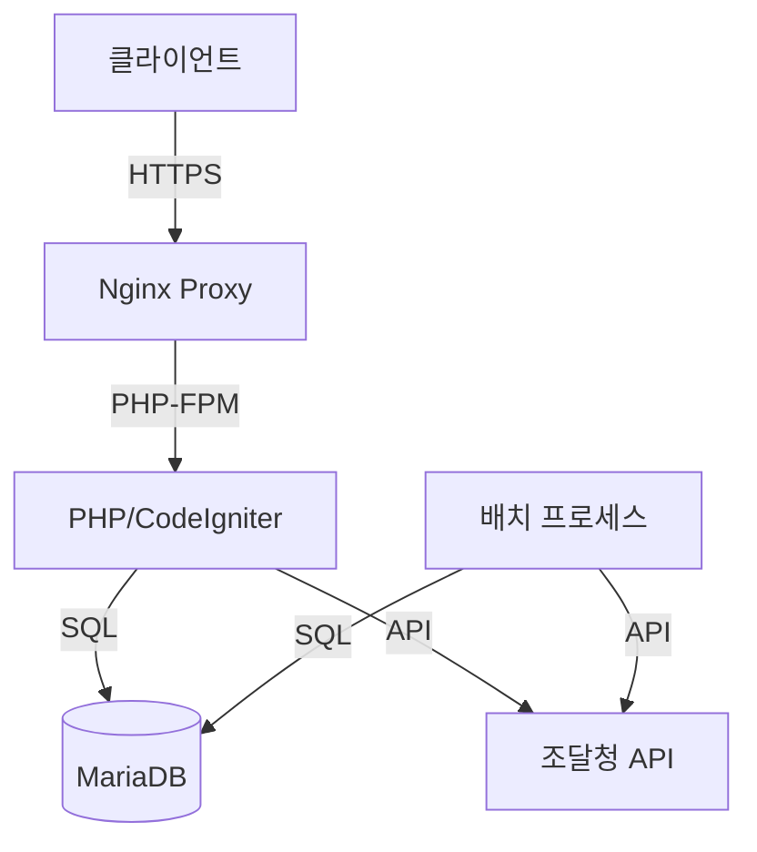

# 시스템 아키텍처 및 설계 문서

## 목차
1. [시스템 개요](#시스템-개요)
2. [아키텍처 구성](#아키텍처-구성)
3. [데이터 처리 아키텍처](#데이터-처리-아키텍처)
4. [시스템 구성요소](#시스템-구성요소)

## 시스템 개요

### 프로젝트 목적
- 조달청 납품요구 데이터 수집 및 관리
- 실적 데이터 분석 및 통계 제공
- 사용자 친화적인 웹 인터페이스 제공

### 주요 기능
- 납품요구 데이터 자동 수집 및 정규화
- 기관별/업체별/품목별 통계 분석
- 사용자 인증 및 권한 관리
- API 기반 데이터 제공

## 아키텍처 구성

### 시스템 구성도

### 컴포넌트 구성
1. 프론트엔드
   - React 기반 SPA
   - Material-UI 컴포넌트
   - JWT 기반 인증

2. 백엔드
   - PHP 8.1
   - CodeIgniter 3.1.13
   - RESTful API

3. 데이터베이스
   - MariaDB 10.6
   - UTF8MB4 문자셋
   - InnoDB 스토리지 엔진

4. 인프라
   - Docker 컨테이너화
   - Nginx 웹서버
   - Linux (Ubuntu 22.04)

## 데이터 처리 아키텍처

### 데이터 수집 프로세스
1. 조달청 API 호출
2. 데이터 정규화
3. 데이터베이스 저장
4. 검증 및 오류 처리

### 데이터 동기화
- 일일 배치 작업
- 증분 업데이트
- 오류 복구 메커니즘

### 캐싱 전략
- API 응답 캐싱
- 데이터베이스 쿼리 캐싱
- 통계 데이터 캐싱

## 시스템 구성요소

### 웹 서버 (Nginx)
- HTTPS 지원
- 리버스 프록시
- 정적 파일 서빙
- 로드 밸런싱

### 애플리케이션 서버
- PHP-FPM
- 세션 관리
- 로깅
- 에러 핸들링

### 데이터베이스 서버
- 마스터-슬레이브 구성
- 백업 전략
- 성능 최적화
- 모니터링

### 배치 서버
- 크론 작업
- 로그 관리
- 알림 시스템
- 오류 복구 