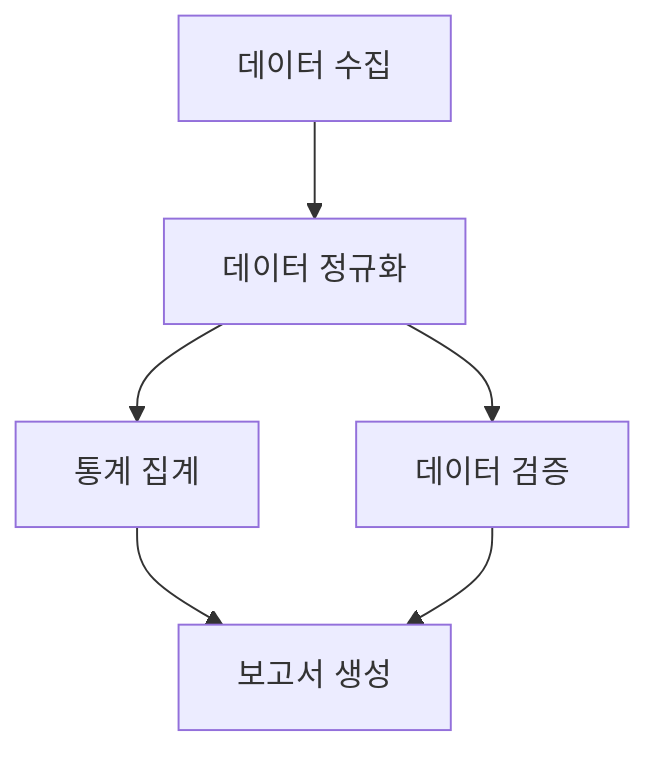

# 배치 프로세스 문서

## 목차
1. [배치 프로세스 개요](#배치-프로세스-개요)
2. [데이터 수집](#데이터-수집)
3. [데이터 정규화](#데이터-정규화)
4. [오류 처리](#오류-처리)

## 배치 프로세스 개요

### 실행 스케줄
| 프로세스 | 실행 주기 | 실행 시간 | 타임아웃 |
|----------|-----------|------------|----------|
| 데이터 수집 | 일간 | 00:00 | 2시간 |
| 데이터 정규화 | 일간 | 02:00 | 1시간 |
| 통계 집계 | 일간 | 03:00 | 30분 |
| 데이터 검증 | 일간 | 03:30 | 30분 |

### 프로세스 의존성

### 모니터링
- 프로세스 상태
- 실행 시간
- 처리 건수
- 오류 발생
- 리소스 사용량

## 데이터 수집

### 조달청 API 호출
- 납품요구 데이터
- 계약 데이터
- 업체 정보
- 기관 정보

### 수집 프로세스
1. API 토큰 획득
2. 데이터 수집 범위 설정
3. 페이지네이션 처리
4. 응답 데이터 저장
5. 중복 체크

### 오류 처리
- API 연결 실패
- 토큰 만료
- 데이터 형식 오류
- 중복 데이터

## 데이터 정규화

### 정규화 규칙
- 날짜 형식 통일
- 금액 단위 변환
- 코드값 매핑
- 문자열 정규화

### 데이터 매핑
| 원본 필드 | 변환 필드 | 규칙 |
|-----------|-----------|------|
| dlvrReqRcptDate | delivery_request_date | YYYYMMDD → YYYY-MM-DD |
| incdecAmt | total_amount | 원단위 변환 |
| dminsttRgnNm | region_name | 지역명 정규화 |
| exclcProdctYn | is_excellent_product | Y/N → 1/0 |

### 정규화 프로세스
1. 원본 데이터 읽기
2. 필드별 정규화 적용
3. 유효성 검증
4. 정규화 데이터 저장
5. 로그 기록

## 오류 처리

### 오류 유형
- 데이터 누락
- 형식 오류
- 유효성 검증 실패
- 중복 데이터
- 시스템 오류

### 오류 처리 프로세스
1. 오류 감지
2. 로그 기록
3. 관리자 알림
4. 재시도 또는 수동 처리
5. 오류 통계 집계

### 재시도 정책
- 최대 재시도 횟수: 3회
- 재시도 간격: 5분
- 재시도 실패 시: 수동 처리 대기

### 알림 설정
- 이메일 알림
- 슬랙 알림
- SMS 알림 (긴급)
- 관리자 대시보드

## 로그 관리

### 로그 항목
- 프로세스 ID
- 실행 시간
- 처리 건수
- 오류 내용
- 소요 시간
- 메모리 사용량

### 로그 저장
- 파일 로그
- DB 로그
- AWS CloudWatch

### 로그 보관
- 보관 기간: 3개월
- 압축 보관: 1년
- 자동 삭제 