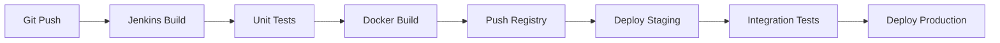

# 운영 및 배포 문서

## 목차
1. [배포 환경](#배포-환경)
2. [서버 접근](#서버-접근)
3. [배포 프로세스](#배포-프로세스)
4. [모니터링](#모니터링)
5. [장애 대응](#장애-대응)

## 배포 환경

### 서버 정보
- **서버 IP**: 52.78.104.83
- **환경**: AWS EC2 (t3.medium)
- **운영체제**: Amazon Linux 2
- **웹 서버**: Nginx 1.20
- **PHP**: 8.1
- **데이터베이스**: MariaDB 10.6

### 인프라 구성
- AWS EC2: t3.medium (2vCPU, 4GB RAM)
- AWS RDS: db.t3.medium (MariaDB 10.6)
- AWS S3: 파일 저장소
- AWS CloudWatch: 모니터링
- AWS Route53: DNS 관리

### 컨테이너 구성
```yaml
version: '3.8'
services:
  web:
    image: rejintech/web:latest
    ports:
      - "80:80"
      - "443:443"
    volumes:
      - ./logs:/var/log/nginx
      - ./ssl:/etc/nginx/ssl
    environment:
      - APP_ENV=production
      - DB_HOST=rejintech-mariadb
      - DB_USER=jintech
      - DB_NAME=jintech

  app:
    image: rejintech/app:latest
    volumes:
      - ./source:/var/www/html
    environment:
      - PHP_FPM_PM=dynamic
      - PHP_FPM_MAX_CHILDREN=50
      - PHP_FPM_START_SERVERS=5
      - PHP_FPM_MIN_SPARE_SERVERS=5
      - PHP_FPM_MAX_SPARE_SERVERS=35

  db:
    image: mariadb:10.6
    volumes:
      - ./mariadb_data:/var/lib/mysql
    environment:
      - MYSQL_ROOT_PASSWORD=secret
      - MYSQL_DATABASE=jintech
      - MYSQL_USER=jintech
      - MYSQL_PASSWORD=secret
```

### 네트워크 구성
- VPC: 10.0.0.0/16
- Public Subnet: 10.0.1.0/24
- Private Subnet: 10.0.2.0/24
- Security Groups:
  - Web: 80, 443
  - App: 9000
  - DB: 3306

## 서버 접근

### SSH 접속
```bash
# SSH 키 권한 설정
chmod 400 ./keys/jiintech-web-key.pem

# 서버 접속
ssh -i ./keys/jiintech-web-key.pem ec2-user@52.78.104.83
```

### 주요 디렉토리
- 웹 루트: `/var/www/html`
- Nginx 설정: `/etc/nginx/conf.d`
- PHP-FPM 설정: `/etc/php-fpm.d`
- 로그 파일: `/var/log/nginx`, `/var/log/php-fpm`
- SSL 인증서: `/etc/nginx/ssl`

### 데이터베이스 접속
- **호스트**: rejintech-mariadb
- **데이터베이스**: jintech
- **사용자**: jintech
- **포트**: 3306

### 권한 관리
- EC2 접속: SSH 키 기반 인증
- 데이터베이스: 계정별 권한 설정
- 파일 시스템: 그룹 기반 권한 관리

## 배포 프로세스

### CI/CD 파이프라인


### 배포 단계
1. 소스 코드 Pull
2. Composer 의존성 설치
3. 환경 설정 파일 복사
4. 데이터베이스 마이그레이션
5. 캐시 초기화
6. 서비스 재시작

### 롤백 절차
1. 이전 버전 이미지 확인
2. 컨테이너 교체
3. 데이터베이스 롤백
4. 서비스 상태 확인
5. 로그 확인

## 모니터링

### 시스템 모니터링
- CPU 사용률
- 메모리 사용량
- 디스크 I/O
- 네트워크 트래픽

### 애플리케이션 모니터링
- 응답 시간
- 오류율
- 동시 접속자 수
- API 호출 통계

### 데이터베이스 모니터링
- 연결 수
- 쿼리 성능
- 테이블 크기
- 복제 상태

### 알림 설정
- CPU 사용률 80% 초과
- 메모리 사용률 90% 초과
- 디스크 사용률 85% 초과
- 5xx 에러 발생
- API 응답 시간 3초 초과

## 장애 대응

### 장애 유형
1. 서비스 중단
   - 웹서버 다운
   - 애플리케이션 서버 다운
   - 데이터베이스 다운

2. 성능 저하
   - 높은 CPU 사용률
   - 메모리 부족
   - 디스크 공간 부족

3. 데이터 문제
   - 데이터 정합성 오류
   - 복제 지연
   - 데이터 손실

### 대응 절차
1. 장애 감지
   - 모니터링 알림
   - 사용자 보고
   - 자동화된 헬스체크

2. 초기 대응
   - 장애 상황 파악
   - 임시 조치 적용
   - 사용자 공지

3. 원인 분석
   - 로그 분석
   - 시스템 상태 확인
   - 이벤트 추적

4. 해결 및 복구
   - 영구적 해결책 적용
   - 서비스 정상화 확인
   - 재발 방지 대책 수립

### 장애 보고
- 장애 내용
- 발생 시간
- 영향 범위
- 조치 사항
- 재발 방지 대책 