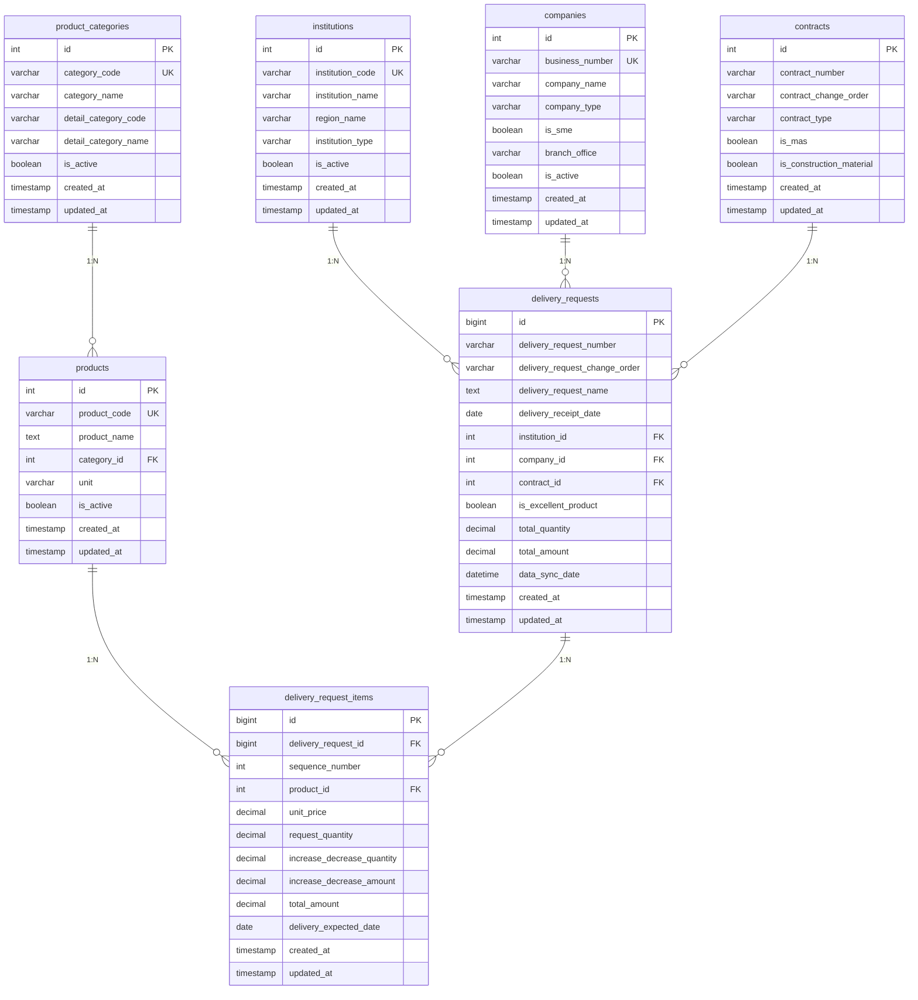

# API용 데이터베이스 설계 문서

**📅 작성일**: 2025-06-23  
**📊 문서 버전**: v1.0  
**🎯 목적**: 조달청 데이터 조회 API를 위한 정규화된 데이터베이스 설계

## 📋 설계 개요

### 🎯 설계 목표
- **정규화**: 데이터 중복 제거 및 무결성 보장
- **성능**: API 요구사항에 최적화된 인덱스 구조
- **확장성**: 향후 기능 확장을 고려한 테이블 설계
- **유지보수성**: 명확한 관계 정의 및 제약조건

### 🔄 기존 문제점 해결
- **비정규화된 구조**: `delivery_request_details` 테이블의 중복 데이터
- **성능 이슈**: 992건 데이터에 52개 필드의 과도한 JOIN
- **데이터 품질**: 0000-00-00 날짜, NULL 값 등 데이터 품질 문제
- **API 호환성**: 클라이언트 요구사항과 맞지 않는 데이터 구조

---

## 🗄️ 테이블 구조 설계

### 1. 📍 institutions (수요기관 마스터)

#### 테이블 정의
```sql
CREATE TABLE institutions (
    id INT(11) AUTO_INCREMENT PRIMARY KEY,
    institution_code VARCHAR(20) NOT NULL UNIQUE COMMENT '수요기관코드',
    institution_name VARCHAR(200) NOT NULL COMMENT '수요기관명',
    region_name VARCHAR(100) NULL COMMENT '수요기관지역명',
    institution_type VARCHAR(50) NULL COMMENT '수요기관구분명',
    is_active BOOLEAN NOT NULL DEFAULT TRUE COMMENT '활성상태',
    created_at TIMESTAMP DEFAULT CURRENT_TIMESTAMP,
    updated_at TIMESTAMP DEFAULT CURRENT_TIMESTAMP ON UPDATE CURRENT_TIMESTAMP
);
```

#### 인덱스 설계
- `PRIMARY KEY`: id
- `UNIQUE INDEX`: institution_code
- `INDEX`: institution_name, region_name, is_active

#### 데이터 현황
- **총 147개** 수요기관
- **101개** 지역으로 분포
- **지방자치단체** 중심의 구성

### 2. 🏢 companies (업체 마스터)

#### 테이블 정의
```sql
CREATE TABLE companies (
    id INT(11) AUTO_INCREMENT PRIMARY KEY,
    business_number VARCHAR(20) NOT NULL UNIQUE COMMENT '사업자등록번호',
    company_name VARCHAR(200) NOT NULL COMMENT '업체명',
    company_type VARCHAR(50) NULL COMMENT '기업구분명',
    is_sme BOOLEAN NULL COMMENT '중소기업여부',
    branch_office VARCHAR(100) NULL COMMENT '지방청명',
    is_active BOOLEAN NOT NULL DEFAULT TRUE COMMENT '활성상태',
    created_at TIMESTAMP DEFAULT CURRENT_TIMESTAMP,
    updated_at TIMESTAMP DEFAULT CURRENT_TIMESTAMP ON UPDATE CURRENT_TIMESTAMP
);
```

#### 인덱스 설계
- `PRIMARY KEY`: id
- `UNIQUE INDEX`: business_number
- `INDEX`: company_name, company_type, is_active

#### 데이터 현황
- **총 280개** 업체
- **중소기업** 위주의 구성
- **전국 지방청** 관할 분포

### 3. 📦 product_categories (품목분류 마스터)

#### 테이블 정의
```sql
CREATE TABLE product_categories (
    id INT(11) AUTO_INCREMENT PRIMARY KEY,
    category_code VARCHAR(20) NOT NULL UNIQUE COMMENT '품목분류번호',
    category_name VARCHAR(100) NOT NULL COMMENT '품명',
    detail_category_code VARCHAR(20) NULL COMMENT '세부품목분류번호',
    detail_category_name VARCHAR(100) NULL COMMENT '세부품명',
    is_active BOOLEAN NOT NULL DEFAULT TRUE COMMENT '활성상태',
    created_at TIMESTAMP DEFAULT CURRENT_TIMESTAMP,
    updated_at TIMESTAMP DEFAULT CURRENT_TIMESTAMP ON UPDATE CURRENT_TIMESTAMP
);
```

#### 인덱스 설계
- `PRIMARY KEY`: id
- `UNIQUE INDEX`: category_code
- `INDEX`: category_name, detail_category_code, is_active

#### 데이터 현황
- **총 164개** 품목분류
- **주요 품목**: 냉난방공조공사, 레미콘, 아스팔트콘크리트 등
- **계층적 분류** 구조

### 4. 🛍️ products (물품 마스터)

#### 테이블 정의
```sql
CREATE TABLE products (
    id INT(11) AUTO_INCREMENT PRIMARY KEY,
    product_code VARCHAR(20) NOT NULL UNIQUE COMMENT '물품식별번호',
    product_name TEXT NOT NULL COMMENT '물품규격명',
    category_id INT(11) NOT NULL COMMENT '품목분류ID',
    unit VARCHAR(20) NULL COMMENT '단위',
    is_active BOOLEAN NOT NULL DEFAULT TRUE COMMENT '활성상태',
    created_at TIMESTAMP DEFAULT CURRENT_TIMESTAMP,
    updated_at TIMESTAMP DEFAULT CURRENT_TIMESTAMP ON UPDATE CURRENT_TIMESTAMP,
    
    FOREIGN KEY (category_id) REFERENCES product_categories(id) ON DELETE RESTRICT
);
```

#### 관계 설계
- **N:1 → product_categories**: 품목분류 참조

#### 데이터 현황
- **총 758개** 물품
- **상세 규격** 포함
- **단위별 관리** (본, 조, 개, m² 등)

### 5. 📋 contracts (계약 마스터)

#### 테이블 정의
```sql
CREATE TABLE contracts (
    id INT(11) AUTO_INCREMENT PRIMARY KEY,
    contract_number VARCHAR(50) NOT NULL COMMENT '계약번호',
    contract_change_order VARCHAR(10) NOT NULL DEFAULT '00' COMMENT '계약변경차수',
    contract_type VARCHAR(50) NULL COMMENT '계약체결방식명',
    is_mas BOOLEAN NOT NULL DEFAULT FALSE COMMENT 'MAS 여부',
    is_construction_material BOOLEAN NOT NULL DEFAULT FALSE COMMENT '건설공사자재직접구매대상여부',
    created_at TIMESTAMP DEFAULT CURRENT_TIMESTAMP,
    updated_at TIMESTAMP DEFAULT CURRENT_TIMESTAMP ON UPDATE CURRENT_TIMESTAMP,
    
    UNIQUE KEY uk_contract (contract_number, contract_change_order)
);
```

#### 유니크 제약조건
- **복합키**: (contract_number, contract_change_order)

#### 데이터 현황
- **총 330개** 계약
- **제3자단가계약** 중심
- **MAS 계약** 구분 관리

### 6. 📝 delivery_requests (납품요구 메인)

#### 테이블 정의
```sql
CREATE TABLE delivery_requests (
    id BIGINT(20) AUTO_INCREMENT PRIMARY KEY,
    delivery_request_number VARCHAR(50) NOT NULL COMMENT '납품요구번호',
    delivery_request_change_order VARCHAR(10) NOT NULL DEFAULT '00' COMMENT '납품요구변경차수',
    delivery_request_name TEXT NULL COMMENT '납품요구건명',
    delivery_request_date DATE NULL COMMENT '납품요구일자',
    delivery_receipt_date DATE NULL COMMENT '납품요구접수일자',
    delivery_deadline_date DATE NULL COMMENT '납품기한일자',
    international_delivery_date DATE NULL COMMENT '국제계약납품요구일자',
    
    institution_id INT(11) NOT NULL COMMENT '수요기관ID',
    company_id INT(11) NOT NULL COMMENT '업체ID',
    contract_id INT(11) NOT NULL COMMENT '계약ID',
    
    is_excellent_product BOOLEAN NOT NULL DEFAULT FALSE COMMENT '우수제품여부',
    is_final_delivery BOOLEAN NOT NULL DEFAULT FALSE COMMENT '최종납품요구여부',
    is_sme_product BOOLEAN NOT NULL DEFAULT FALSE COMMENT '중소기업제품여부',
    
    total_quantity DECIMAL(15,3) NOT NULL DEFAULT 0 COMMENT '총 납품요구수량',
    total_amount DECIMAL(15,2) NOT NULL DEFAULT 0 COMMENT '총 납품요구금액',
    
    data_sync_date DATETIME NULL COMMENT '데이터동기화일시',
    created_at TIMESTAMP DEFAULT CURRENT_TIMESTAMP,
    updated_at TIMESTAMP DEFAULT CURRENT_TIMESTAMP ON UPDATE CURRENT_TIMESTAMP,
    
    UNIQUE KEY uk_delivery_request (delivery_request_number, delivery_request_change_order),
    FOREIGN KEY (institution_id) REFERENCES institutions(id) ON DELETE RESTRICT,
    FOREIGN KEY (company_id) REFERENCES companies(id) ON DELETE RESTRICT,
    FOREIGN KEY (contract_id) REFERENCES contracts(id) ON DELETE RESTRICT
);
```

#### 관계 설계
- **N:1 → institutions**: 수요기관 참조
- **N:1 → companies**: 업체 참조  
- **N:1 → contracts**: 계약 참조

#### 데이터 현황
- **총 437개** 납품요구
- **우수제품 vs 일반제품** 구분
- **총 62억원** 규모

### 7. 📋 delivery_request_items (납품요구 상세)

#### 테이블 정의
```sql
CREATE TABLE delivery_request_items (
    id BIGINT(20) AUTO_INCREMENT PRIMARY KEY,
    delivery_request_id BIGINT(20) NOT NULL COMMENT '납품요구ID',
    sequence_number INT(11) NOT NULL COMMENT '납품요구상세순번',
    
    product_id INT(11) NOT NULL COMMENT '물품ID',
    
    unit_price DECIMAL(15,2) NOT NULL DEFAULT 0 COMMENT '물품단가',
    request_quantity DECIMAL(15,3) NOT NULL DEFAULT 0 COMMENT '납품요구수량',
    delivery_quantity DECIMAL(15,3) NOT NULL DEFAULT 0 COMMENT '납품수량',
    increase_decrease_quantity DECIMAL(15,3) NOT NULL DEFAULT 0 COMMENT '증감수량',
    increase_decrease_amount DECIMAL(15,2) NOT NULL DEFAULT 0 COMMENT '증감금액',
    total_amount DECIMAL(15,2) NOT NULL DEFAULT 0 COMMENT '총금액',
    
    delivery_expected_date DATE NULL COMMENT '납품예정일자',
    delivery_completion_date DATE NULL COMMENT '납품완료일자',
    delivery_status_code VARCHAR(10) NULL COMMENT '납품상태코드',
    delivery_status_name VARCHAR(50) NULL COMMENT '납품상태명',
    
    created_at TIMESTAMP DEFAULT CURRENT_TIMESTAMP,
    updated_at TIMESTAMP DEFAULT CURRENT_TIMESTAMP ON UPDATE CURRENT_TIMESTAMP,
    
    UNIQUE KEY uk_delivery_item (delivery_request_id, sequence_number),
    FOREIGN KEY (delivery_request_id) REFERENCES delivery_requests(id) ON DELETE CASCADE,
    FOREIGN KEY (product_id) REFERENCES products(id) ON DELETE RESTRICT
);
```

#### 관계 설계
- **N:1 → delivery_requests**: 납품요구 참조 (CASCADE 삭제)
- **N:1 → products**: 물품 참조

#### 데이터 현황
- **총 992개** 납품요구 상세
- **평균 628만원/건**
- **증감 금액** 정확히 추적

---

## 🔍 데이터 관계도 (ERD)



---

## 📊 마이그레이션 결과

### ✅ 성공적으로 처리된 데이터

| 테이블명 | 한글명 | 데이터 수 | 비고 |
|---------|--------|-----------|------|
| institutions | 수요기관 마스터 | 147건 | 전국 지방자치단체 중심 |
| companies | 업체 마스터 | 280건 | 중소기업 위주 |
| product_categories | 품목분류 마스터 | 164건 | 계층적 분류 구조 |
| products | 물품 마스터 | 758건 | 상세 규격 포함 |
| contracts | 계약 마스터 | 330건 | 제3자단가계약 중심 |
| delivery_requests | 납품요구 메인 | 437건 | 건별 집계 정보 |
| delivery_request_items | 납품요구 상세 | 992건 | 원본 데이터와 1:1 매칭 |

### 🔄 데이터 정합성 검증

#### 금액 집계 검증
```sql
-- 조달(우수제품) 금액
SELECT SUM(dri.increase_decrease_amount) 
FROM delivery_request_items dri
JOIN delivery_requests dr ON dr.id = dri.delivery_request_id
WHERE dr.is_excellent_product = TRUE;
-- 결과: 635,286,884원

-- 마스(일반제품) 금액  
SELECT SUM(dri.increase_decrease_amount)
FROM delivery_request_items dri
JOIN delivery_requests dr ON dr.id = dri.delivery_request_id
WHERE dr.is_excellent_product = FALSE;
-- 결과: 5,601,942,390원

-- 전체 금액
SELECT SUM(increase_decrease_amount) FROM delivery_request_items;
-- 결과: 6,237,229,274원
```

---

## 🚀 API 최적화 설계

### 📈 성능 최적화 인덱스

#### 1. 검색 최적화
```sql
-- 수요기관별 검색
INDEX idx_delivery_requests_institution (institution_id, delivery_receipt_date)

-- 업체별 검색  
INDEX idx_delivery_requests_company (company_id, delivery_receipt_date)

-- 품목별 검색
INDEX idx_delivery_items_product (product_id, increase_decrease_amount)

-- 우수제품 여부별 집계
INDEX idx_delivery_requests_excellent (is_excellent_product, total_amount)
```

#### 2. 필터링 최적화
```sql
-- 날짜 범위 검색
INDEX idx_delivery_receipt_date (delivery_receipt_date)

-- 금액 범위 검색
INDEX idx_increase_decrease_amount (increase_decrease_amount)

-- 지역별 검색
INDEX idx_institutions_region (region_name, is_active)
```

### 🔍 API 응답 최적화 쿼리

#### 기본 목록 조회
```sql
SELECT 
    dr.delivery_request_number as dlvrReqNo,
    dr.delivery_receipt_date as dlvrReqRcptDate,
    i.institution_name as dminsttNm,
    i.region_name as dminsttRgnNm,
    c.company_name as corpNm,
    dr.delivery_request_name as dlvrReqNm,
    pc.category_name as prdctClsfcNoNm,
    pc.detail_category_name as dtilPrdctClsfcNoNm,
    p.product_code as prdctIdntNo,
    p.product_name as prdctIdntNoNm,
    dri.increase_decrease_quantity as incdecQty,
    dri.unit_price as prdctUprc,
    dri.increase_decrease_amount as incdecAmt,
    CASE WHEN dr.is_excellent_product THEN 'Y' ELSE 'N' END as exclcProdctYn
FROM delivery_request_items dri
JOIN delivery_requests dr ON dr.id = dri.delivery_request_id
JOIN institutions i ON i.id = dr.institution_id
JOIN companies c ON c.id = dr.company_id
JOIN products p ON p.id = dri.product_id
JOIN product_categories pc ON pc.id = p.category_id
ORDER BY dr.delivery_receipt_date DESC, dr.id, dri.sequence_number
LIMIT 20 OFFSET 0;
```

#### 금액 집계 쿼리
```sql
SELECT 
    SUM(CASE WHEN dr.is_excellent_product THEN dri.increase_decrease_amount ELSE 0 END) as jodalTotalAmount,
    SUM(CASE WHEN NOT dr.is_excellent_product THEN dri.increase_decrease_amount ELSE 0 END) as masTotalAmount,
    SUM(dri.increase_decrease_amount) as totalAmount
FROM delivery_request_items dri
JOIN delivery_requests dr ON dr.id = dri.delivery_request_id;
```

#### 필터 옵션 쿼리
```sql
-- 품명 필터
SELECT DISTINCT pc.category_name 
FROM product_categories pc 
WHERE pc.is_active = TRUE 
ORDER BY pc.category_name;

-- 수요기관 필터
SELECT DISTINCT i.institution_name 
FROM institutions i 
WHERE i.is_active = TRUE 
ORDER BY i.institution_name;

-- 업체 필터
SELECT DISTINCT c.company_name 
FROM companies c 
WHERE c.is_active = TRUE 
ORDER BY c.company_name;
```

---

## 🔒 데이터 무결성 보장

### 외래키 제약조건
- **RESTRICT**: 참조되는 데이터 삭제 방지
- **CASCADE**: 상위 데이터 삭제시 하위 데이터 자동 삭제

### 유니크 제약조건
- **institution_code**: 수요기관코드 중복 방지
- **business_number**: 사업자등록번호 중복 방지
- **product_code**: 물품식별번호 중복 방지
- **복합키**: 계약 및 납품요구의 변경차수 관리

### 체크 제약조건
- **날짜 유효성**: 0000-00-00 → NULL 변환
- **금액 범위**: DECIMAL(15,2) 정밀도 보장
- **불린 값**: 명확한 TRUE/FALSE 처리

---

## 🎯 다음 단계

### 1. API 모델 클래스 개발
- CodeIgniter 모델 클래스 생성
- 복잡한 JOIN 쿼리 최적화
- 페이징 및 필터링 로직 구현

### 2. API 컨트롤러 개발
- RESTful API 엔드포인트 구현
- 요구사항 명세에 맞는 응답 형식
- 에러 처리 및 유효성 검증

### 3. 성능 모니터링
- 쿼리 실행 계획 분석
- 인덱스 효율성 검증
- 캐싱 전략 수립

---

**📝 문서 작성**: 2025-06-23  
**🔄 다음 업데이트**: API 구현 완료 후  
**👨‍💻 상태**: 데이터베이스 설계 완료, API 개발 준비 완료 ✨ 