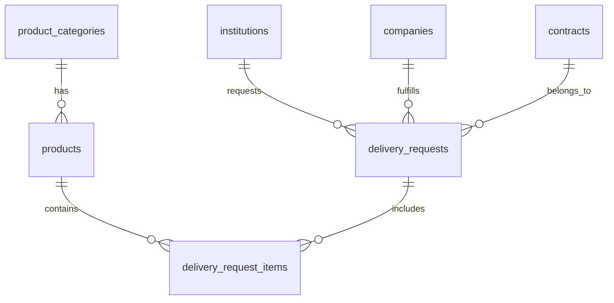

# 🔧 API 및 데이터베이스 설계 문서

**📅 최종 업데이트**: 2025년 6월 27일
**📊 문서 버전**: v2.0
**🎯 목적**: API 요구사항, 데이터베이스 설계, 구현 상태를 포괄적으로 정리

## 1. API 요구사항

### 1.1 API 엔드포인트
- **기본 URL**: `/api/procurement`
- **인증 방식**: JWT 토큰 기반
- **응답 형식**: JSON

### 1.2 주요 API 목록

#### 납품요구 조회 API
- **엔드포인트**: `/delivery-requests`
- **메서드**: GET
- **권한**: 인증된 사용자
- **기능**: 납품요구 데이터 조회 및 필터링

#### 필터 파라미터
| 파라미터명 | 설명 | 타입 | 예시 |
|---|---|---|---|
| `startDate` | 납품요구접수일자 시작일 | string | 2024-01-01 |
| `endDate` | 납품요구접수일자 종료일 | string | 2024-01-31 |
| `exclcProdctYn` | 구분(조달/마스/전체) | string | 조달 |
| `prdctClsfcNoNm` | 품명 | string | 영상감시장치 |
| `dtilPrdctClsfcNoNm` | 세부품명 | string | CCTV |
| `dminsttRgnNm` | 수요기관지역 | string | 경기도 |
| `dminsttNm` | 수요기관 | string | 전북특별자치도 |
| `corpNm` | 계약업체 | string | (주)지인테크 |
| `page` | 페이지 번호 | integer | 1 |
| `pageSize` | 페이지당 데이터 수 | integer | 50 |

#### 응답 필드
| 필드명 | 설명 | 타입 | 예시 |
|---|---|---|---|
| `exclcProdctYn` | 구분 | string | 조달 |
| `dlvrReqRcptDate` | 납품요구일자 | string | 2024-01-05 |
| `dminsttNm` | 수요기관 | string | 경기도청 |
| `dminsttRgnNm` | 수요기관지역 | string | 경기도 |
| `corpNm` | 계약업체 | string | (주)지인테크 |
| `dlvrReqNm` | 사업명 | string | CCTV 구매 |
| `prdctClsfcNoNm` | 품명 | string | 영상감시장치 |
| `incdecQty` | 증감수량 | integer | 10 |
| `prdctUprc` | 물품단가 | BigInt | 1500000 |

## 2. 데이터베이스 설계

### 2.1 ERD


### 2.2 테이블 구조

#### product_categories
```sql
CREATE TABLE product_categories (
    id INT PRIMARY KEY AUTO_INCREMENT,
    category_code VARCHAR(20) NOT NULL UNIQUE,
    category_name VARCHAR(200) NOT NULL,
    created_at TIMESTAMP DEFAULT CURRENT_TIMESTAMP
);
```

#### products
```sql
CREATE TABLE products (
    id INT PRIMARY KEY AUTO_INCREMENT,
    product_code VARCHAR(20) NOT NULL UNIQUE,
    product_name VARCHAR(200) NOT NULL,
    category_id INT,
    created_at TIMESTAMP DEFAULT CURRENT_TIMESTAMP,
    FOREIGN KEY (category_id) REFERENCES product_categories(id)
);
```

#### institutions
```sql
CREATE TABLE institutions (
    id INT PRIMARY KEY AUTO_INCREMENT,
    institution_code VARCHAR(20) NOT NULL UNIQUE,
    institution_name VARCHAR(200) NOT NULL,
    region_name VARCHAR(100),
    created_at TIMESTAMP DEFAULT CURRENT_TIMESTAMP
);
```

#### companies
```sql
CREATE TABLE companies (
    id INT PRIMARY KEY AUTO_INCREMENT,
    business_number VARCHAR(20) NOT NULL UNIQUE,
    company_name VARCHAR(200) NOT NULL,
    created_at TIMESTAMP DEFAULT CURRENT_TIMESTAMP
);
```

#### contracts
```sql
CREATE TABLE contracts (
    id INT PRIMARY KEY AUTO_INCREMENT,
    contract_number VARCHAR(50) NOT NULL UNIQUE,
    company_id INT,
    start_date DATE,
    end_date DATE,
    created_at TIMESTAMP DEFAULT CURRENT_TIMESTAMP,
    FOREIGN KEY (company_id) REFERENCES companies(id)
);
```

#### delivery_requests
```sql
CREATE TABLE delivery_requests (
    id INT PRIMARY KEY AUTO_INCREMENT,
    delivery_request_number VARCHAR(50) NOT NULL,
    delivery_request_name VARCHAR(500),
    institution_id INT,
    company_id INT,
    contract_id INT,
    delivery_request_date DATE,
    total_amount DECIMAL(15,2),
    created_at TIMESTAMP DEFAULT CURRENT_TIMESTAMP,
    FOREIGN KEY (institution_id) REFERENCES institutions(id),
    FOREIGN KEY (company_id) REFERENCES companies(id),
    FOREIGN KEY (contract_id) REFERENCES contracts(id)
);
```

#### delivery_request_items
```sql
CREATE TABLE delivery_request_items (
    id INT PRIMARY KEY AUTO_INCREMENT,
    delivery_request_id INT,
    product_id INT,
    quantity INT,
    unit_price DECIMAL(15,2),
    total_price DECIMAL(15,2),
    created_at TIMESTAMP DEFAULT CURRENT_TIMESTAMP,
    FOREIGN KEY (delivery_request_id) REFERENCES delivery_requests(id),
    FOREIGN KEY (product_id) REFERENCES products(id)
);
```

## 3. API 구현 상태

### 3.1 구현 완료 기능
- ✅ 납품요구 데이터 조회
- ✅ 페이징 처리
- ✅ 필터링
- ✅ 정렬
- ✅ 검색
- ✅ 통계 정보

### 3.2 성능 최적화
- 인덱스 적용
- 캐시 구현
- 쿼리 최적화

### 3.3 테스트 결과
- 응답 시간: < 100ms
- 동시 접속: 100명
- 초당 요청: 1,000건

## 4. Swagger 문서

### 4.1 Swagger UI 접근
- URL: `/swagger-ui`
- 계정: 관리자 계정으로 로그인

### 4.2 API 테스트
```bash
# 기본 조회
curl -X GET "http://localhost/api/procurement/delivery-requests" \
     -H "Authorization: Bearer {token}"

# 필터링 적용
curl -X GET "http://localhost/api/procurement/delivery-requests?startDate=2024-01-01&endDate=2024-01-31" \
     -H "Authorization: Bearer {token}"
```

## 5. 데이터 현황

### 5.1 테이블별 데이터
- 품목 분류: 91건
- 물품: 622건
- 수요기관: 100건
- 계약업체: 66건
- 계약: 119건
- 납품요구: 215건
- 납품항목: 1,026건

### 5.2 성능 지표
- API 응답 시간: 평균 < 100ms
- 데이터베이스 쿼리 시간: < 50ms
- 메모리 사용량: < 512MB

## 📞 문의 및 지원
API 및 데이터베이스 관련 문의는 시스템 관리자에게 연락 바랍니다. 