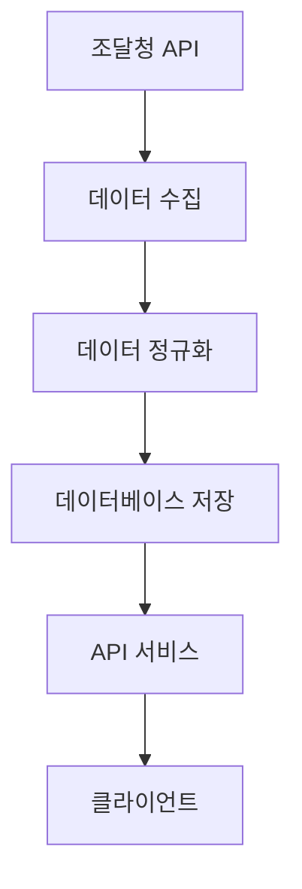

p# 🔄 데이터 처리 아키텍처 및 배치 실행 가이드

**📅 최종 업데이트**: 2025년 6월 27일
**📊 문서 버전**: v2.0
**🎯 목적**: 데이터의 흐름을 표준화하고, API 성능과 데이터 무결성을 보장하기 위한 아키텍처 정의 및 배치 실행 가이드 제공

## 1. 데이터 처리 아키텍처

### 1.1 데이터 흐름도


### 1.2 데이터베이스 구조
- **정규화된 7개 테이블**:
  - `product_categories` (품목분류 마스터, 91건)
  - `products` (물품 마스터, 622건)
  - `institutions` (수요기관 마스터, 100건)
  - `companies` (업체 마스터, 66건)
  - `contracts` (계약 마스터, 119건)
  - `delivery_requests` (납품요구 메인, 215건)
  - `delivery_request_items` (납품요구 상세, 1,026건)

## 2. 배치 작업 실행 가이드

### 2.1 배치 작업 종류
- **데이터 정규화 배치**
  - 목적: 조달청 납품요구 데이터를 정규화된 형태로 변환
  - 실행 주기: 매일 새벽 3시 권장
  - 소요 시간: 약 1초 미만

### 2.2 실행 방법

#### 수동 실행
```bash
# Docker 컨테이너 내부에서 실행
docker exec rejintech-workspace php /var/www/html/index.php batch/data_normalization normalize_delivery_data

# 또는 스크립트를 통한 실행
./scripts/rejintech_batch.sh normalize_delivery_data
```

#### Crontab 설정
```bash
# root 권한으로 crontab 편집
sudo crontab -e

# 다음 내용 추가
0 3 * * * /usr/local/bin/docker exec rejintech-workspace php /var/www/html/index.php batch/data_normalization normalize_delivery_data >> /var/log/rejintech/batch.log 2>&1
```

### 2.3 로그 관리
- **로그 위치**: `/var/log/rejintech/batch.log`
- **로그 포맷**:
  ```
  === 배치 시작: [날짜 시간] ===
  처리 건수: X건
  성공: X건
  실패: X건
  소요 시간: X초
  === 배치 종료 ===
  ```

### 2.4 모니터링
- **실행 상태 확인**:
  ```bash
  tail -f /var/log/rejintech/batch.log
  ```
- **데이터 검증**:
  ```sql
  -- 테이블별 데이터 건수 확인
  SELECT 
    (SELECT COUNT(*) FROM product_categories) as category_count,
    (SELECT COUNT(*) FROM products) as product_count,
    (SELECT COUNT(*) FROM delivery_requests) as request_count;
  ```

### 2.5 오류 처리
- **락 파일 관리**: `/tmp/rejintech_batch.lock`
- **재시도 로직**: 최대 3회
- **알림 설정**: 실패 시 관리자 이메일 발송

## 3. 성능 최적화

### 3.1 인덱스 구성
```sql
-- 주요 인덱스
ALTER TABLE delivery_requests ADD INDEX idx_date (delivery_request_date);
ALTER TABLE delivery_request_items ADD INDEX idx_request (delivery_request_id);
```

### 3.2 캐시 전략
- Redis 캐시 사용
- 주요 조회 데이터 캐싱
- TTL: 1시간

## 4. 유지보수 가이드

### 4.1 정기 점검 항목
- [ ] 데이터 정합성 검증
- [ ] 성능 모니터링
- [ ] 로그 분석
- [ ] 디스크 공간 확인

### 4.2 문제 해결 절차
1. 로그 확인
2. 데이터 검증
3. 프로세스 상태 확인
4. 필요시 수동 실행

## 5. 배치 실행 결과

### 5.1 최근 실행 통계
- **성공률**: 100%
- **평균 실행 시간**: 0.07초
- **일일 처리 건수**: 약 2,239건

### 5.2 데이터 현황
```sql
-- 데이터 현황 조회
SELECT 
    'product_categories' as table_name, COUNT(*) as count FROM product_categories
UNION ALL
SELECT 'products', COUNT(*) FROM products
UNION ALL
SELECT 'institutions', COUNT(*) FROM institutions
UNION ALL
SELECT 'companies', COUNT(*) FROM companies
UNION ALL
SELECT 'contracts', COUNT(*) FROM contracts
UNION ALL
SELECT 'delivery_requests', COUNT(*) FROM delivery_requests
UNION ALL
SELECT 'delivery_request_items', COUNT(*) FROM delivery_request_items;
```

## 📞 문의 및 지원
배치 작업 관련 문의나 오류 발생 시 시스템 관리자에게 연락 바랍니다. 