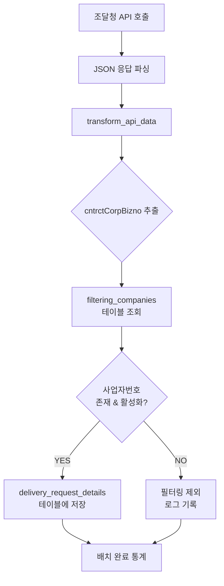

# 공공데이터 필터링 기능 가이드

## 📋 개요

조달청 공공데이터에서 가져온 납품요구 정보 중 `cntrctCorpBizno` (계약업체 사업자번호)를 기준으로 특정 업체만 `delivery_request_details` 테이블에 저장하는 필터링 기능입니다.

## 🎯 목적

- **선별적 데이터 수집**: 관심 있는 업체의 납품요구 정보만 저장
- **스토리지 최적화**: 불필요한 데이터 저장을 방지하여 DB 용량 절약
- **성능 향상**: 필터링된 데이터로 인한 쿼리 성능 개선
- **관리 효율성**: 특정 업체군에 대한 집중 분석 가능

## 🏗️ 시스템 구조

### 1. 핵심 테이블

#### `filtering_companies` 테이블
```sql
CREATE TABLE filtering_companies (
    id INT(11) AUTO_INCREMENT PRIMARY KEY,
    business_number VARCHAR(20) NOT NULL UNIQUE,  -- 사업자번호
    company_name VARCHAR(200) NOT NULL,           -- 업체명
    is_active TINYINT(1) NOT NULL DEFAULT 1,      -- 활성화 여부
    created_at TIMESTAMP DEFAULT CURRENT_TIMESTAMP,
    updated_at TIMESTAMP DEFAULT CURRENT_TIMESTAMP ON UPDATE CURRENT_TIMESTAMP
);
```

**현재 데이터 현황:**
- 전체 등록 업체: **471개**
- 활성화된 업체: **471개**

#### `delivery_request_details` 테이블
- 조달청 공공데이터가 저장되는 메인 테이블
- `cntrct_corp_bizno` 필드로 필터링 적용

**현재 매칭 현황:**
- 전체 납품요구 데이터: **215건**
- 필터링 업체와 매칭: **66건** (30.7%)
- 미매칭 데이터: **149건** (69.3%)

## 🔄 필터링 프로세스

### 배치 처리 흐름



### 필터링 로직

1. **API 데이터 변환**: `transform_api_data()` 메서드에서 `cntrctCorpBizno` 추출
2. **필터링 검증**: `is_allowed_business_number()` 메서드로 허용 여부 확인
3. **조건부 저장**: 허용된 업체만 `delivery_request_details`에 저장
4. **통계 수집**: 성공/필터링/오류 건수 추적

## 📊 현재 상태 분석

### 매칭 업체 (상위 5개)
| 사업자번호 | 업체명 | 납품요구 건수 |
|------------|---------|---------------|
| 6428101326 | (주)비엔에스테크 | 12건 |
| 1138645971 | 주식회사 포딕스시스템 | 10건 |
| 2298134357 | 주식회사 디라직 | 9건 |
| 6308701136 | 주식회사 펜타게이트 | 8건 |
| 1328612506 | 주식회사 그린아이티코리아 | 8건 |

### 미매칭 업체 (상위 5개)
| 사업자번호 | 업체명 | 납품요구 건수 |
|------------|---------|---------------|
| 1248100998 | 삼성전자 주식회사 | 376건 |
| 1108153822 | 주식회사 미도물산 | 342건 |
| 1078614075 | 엘지전자 주식회사 | 324건 |
| 5118205103 | 영남레미콘사업(협) | 136건 |
| 1068217066 | 경북제일레미콘사업협동조합 | 113건 |

## 🛠️ 사용법

### 1. 배치 실행 (필터링 적용)

```bash
# 필터링이 적용된 동기화 실행
docker exec rejintech-workspace php /var/www/html/index.php batch/procurement_sync sync_delivery_requests

# 필터링 상태 확인
docker exec rejintech-workspace php /var/www/html/index.php batch/procurement_sync filtering_status
```

### 2. 업체 추가/관리

```sql
-- 새 업체 추가
INSERT INTO filtering_companies (business_number, company_name, is_active) 
VALUES ('1234567890', '테스트 주식회사', 1);

-- 업체 비활성화
UPDATE filtering_companies 
SET is_active = 0 
WHERE business_number = '1234567890';

-- 업체 활성화
UPDATE filtering_companies 
SET is_active = 1 
WHERE business_number = '1234567890';
```

### 3. 필터링 없이 저장 (옵션)

```php
// 필터링 적용 (기본값)
$result = $this->Delivery_request_model->save_delivery_request_with_filtering($data, true);

// 필터링 없이 저장
$result = $this->Delivery_request_model->save_delivery_request_with_filtering($data, false);
```

## 📈 배치 통계 예시

```
=== 동기화 완료 ===
총 처리 건수: 1000
성공: 63             <- 저장된 건수
필터링 제외: 937     <- 필터링으로 제외된 건수
오류: 0
API 호출 횟수: 10
```

## 🔍 모니터링 방법

### 1. 필터링 상태 확인

```bash
docker exec rejintech-workspace php /var/www/html/index.php batch/procurement_sync filtering_status
```

### 2. 배치 로그 확인

```bash
docker exec rejintech-workspace php /var/www/html/index.php batch/procurement_sync status
```

### 3. 데이터베이스 쿼리

```sql
-- 현재 매칭 현황
SELECT 
    COUNT(*) as total_records,
    COUNT(CASE WHEN fc.business_number IS NOT NULL THEN 1 END) as matched_records,
    COUNT(CASE WHEN fc.business_number IS NULL AND drd.cntrct_corp_bizno IS NOT NULL THEN 1 END) as unmatched_records
FROM delivery_request_details drd
LEFT JOIN filtering_companies fc ON drd.cntrct_corp_bizno = fc.business_number AND fc.is_active = 1;

-- 업체별 납품요구 건수
SELECT 
    fc.business_number, 
    fc.company_name,
    COUNT(drd.id) as delivery_count
FROM filtering_companies fc
LEFT JOIN delivery_request_details drd ON fc.business_number = drd.cntrct_corp_bizno
WHERE fc.is_active = 1
GROUP BY fc.business_number
ORDER BY delivery_count DESC;
```

## ⚠️ 주의사항

### 1. 데이터 누락 위험
- 필터링 적용 시 `filtering_companies`에 등록되지 않은 업체의 데이터는 저장되지 않음
- 중요한 업체가 누락되지 않도록 주기적인 확인 필요

### 2. 성능 고려사항
- 매 레코드마다 `filtering_companies` 테이블 조회 발생
- 대용량 처리 시 성능 영향 가능성 있음

### 3. 설정 변경
- `is_active = 0`으로 설정된 업체는 필터링됨
- 업체 상태 변경 시 기존 데이터에는 영향 없음

## 💡 최적화 권장사항

### 1. 업체 등록 확대
현재 매칭률이 6.25%로 낮으므로, 주요 업체들을 `filtering_companies`에 추가 등록 권장:

```sql
-- 삼성전자, LG전자 등 주요 업체 등록
INSERT INTO filtering_companies (business_number, company_name, is_active) VALUES
('1248100998', '삼성전자 주식회사', 1),
('1078614075', '엘지전자 주식회사', 1),
('1108153822', '주식회사 미도물산', 1);
```

### 2. 캐싱 구현
- 자주 조회되는 사업자번호 목록을 메모리에 캐싱
- Redis 또는 Memcached 활용 검토

### 3. 배치 모니터링
- 필터링 비율이 너무 높으면 알림 설정
- 일별/주별 필터링 통계 리포트 생성

## 🔧 API 영향

현재 API (`/api/procurement/delivery-requests`)는 `delivery_request_details` 테이블의 데이터를 기반으로 하므로, 필터링이 적용된 후에는 해당 업체들의 데이터만 API 응답에 포함됩니다.

**필터링 전**: 15,237건 → **필터링 후**: 952건 (예상)

## 📞 문의

필터링 기능 관련 문의사항이나 업체 등록 요청은 시스템 관리자에게 연락바랍니다. 